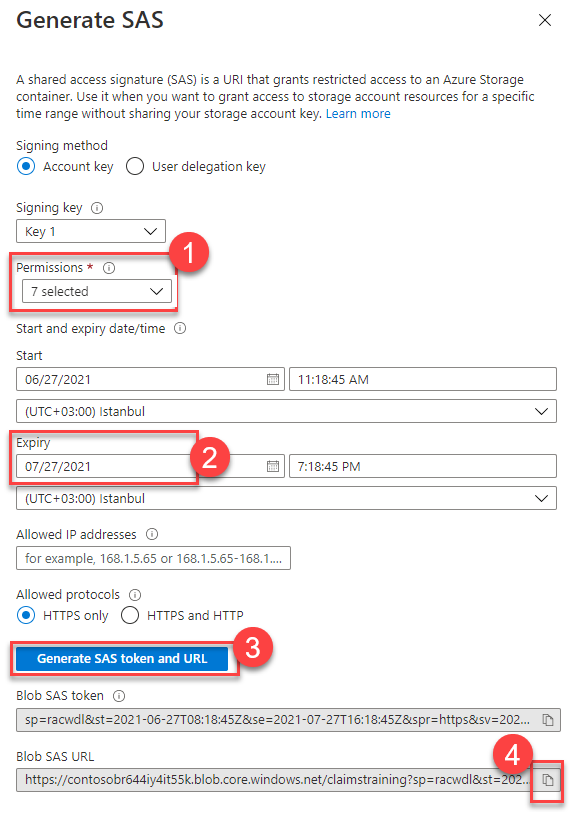
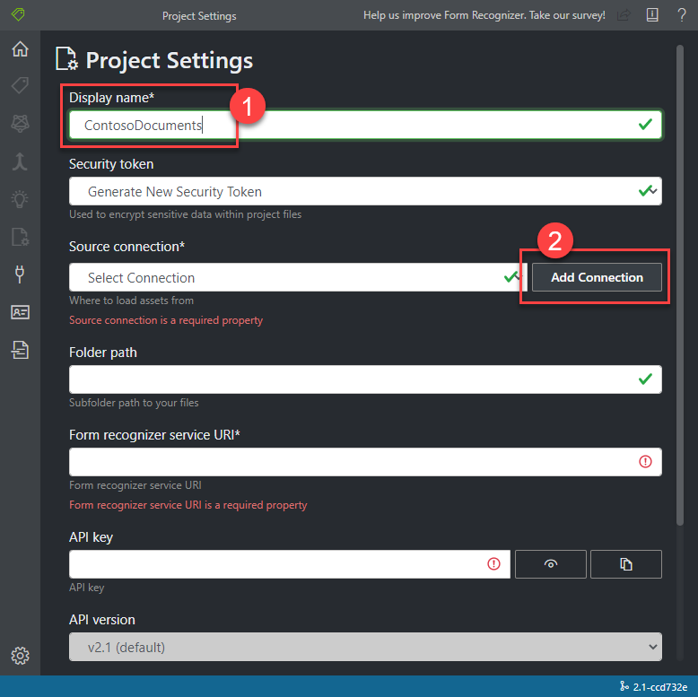
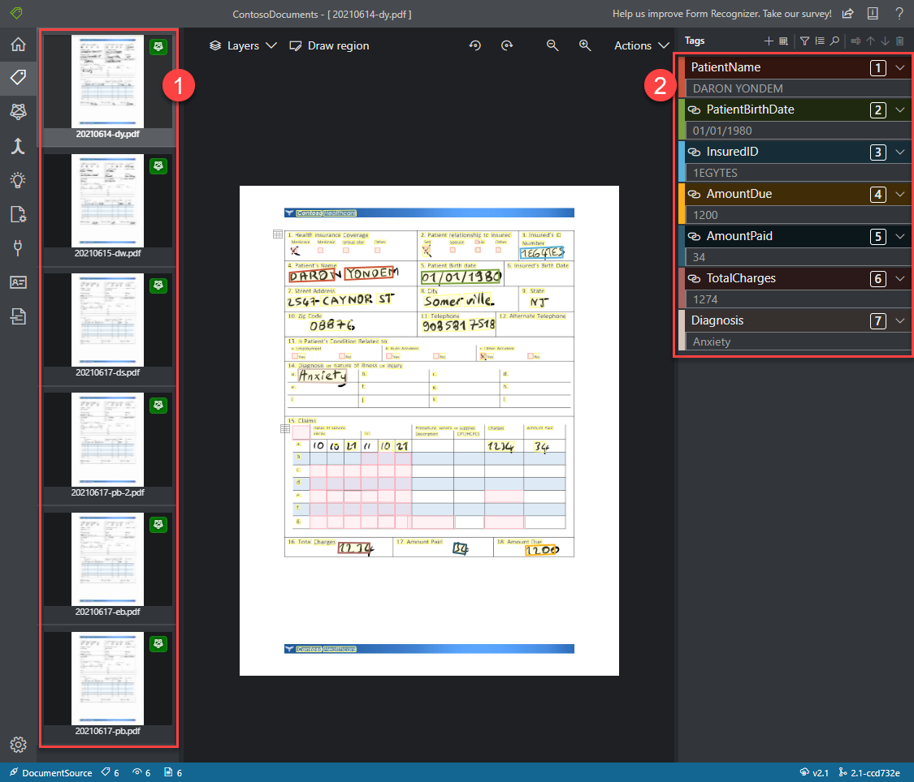
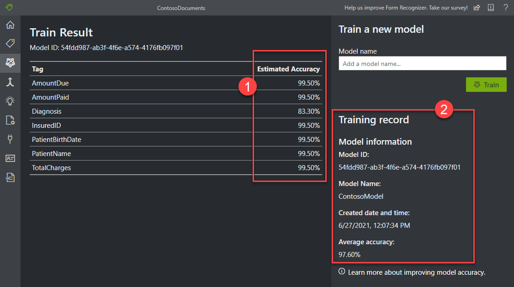

[Insert workshop name here]

Hands-on lab step-by-step

[Insert date here Month Year]

Information in this document, including URL and other Internet Web site references, is subject to change without notice. Unless otherwise noted, the example companies, organizations, products, domain names, e-mail addresses, logos, people, places, and events depicted herein are fictitious, and no association with any real company, organization, product, domain name, e-mail address, logo, person, place or event is intended or should be inferred. Complying with all applicable copyright laws is the responsibility of the user. Without limiting the rights under copyright, no part of this document may be reproduced, stored in or introduced into a retrieval system, or transmitted in any form or by any means (electronic, mechanical, photocopying, recording, or otherwise), or for any purpose, without the express written permission of Microsoft Corporation.

Microsoft may have patents, patent applications, trademarks, copyrights, or other intellectual property rights covering subject matter in this document. Except as expressly provided in any written license agreement from Microsoft, the furnishing of this document does not give you any license to these patents, trademarks, copyrights, or other intellectual property.

The names of manufacturers, products, or URLs are provided for informational purposes only and Microsoft makes no representations and warranties, either expressed, implied, or statutory, regarding these manufacturers or the use of the products with any Microsoft technologies. The inclusion of a manufacturer or product does not imply endorsement of Microsoft of the manufacturer or product. Links may be provided to third party sites. Such sites are not under the control of Microsoft and Microsoft is not responsible for the contents of any linked site or any link contained in a linked site, or any changes or updates to such sites. Microsoft is not responsible for webcasting or any other form of transmission received from any linked site. Microsoft is providing these links to you only as a convenience, and the inclusion of any link does not imply endorsement of Microsoft of the site or the products contained therein.

© 2021 Microsoft Corporation. All rights reserved.

Microsoft and the trademarks listed at <https://www.microsoft.com/en-us/legal/intellectualproperty/Trademarks/Usage/General.aspx> are trademarks of the Microsoft group of companies. All other trademarks are property of their respective owners.

**Contents**

<!-- TOC -->

- [\[insert workshop name here\] hands-on lab step-by-step](#insert-workshop-name-here-hands-on-lab-step-by-step)
  - [Abstract and learning objectives](#abstract-and-learning-objectives)
  - [Overview](#overview)
  - [Solution architecture](#solution-architecture)
  - [Requirements](#requirements)
  - [Before the hands-on lab](#before-the-hands-on-lab)
  - [Exercise 1: Extract Text and Structure from Documents with Forms Recognizer](#exercise-1-extract-text-and-structure-from-documents-with-forms-recognizer)
    - [Task 1: Prepare Custom Model to process documents](#task-1-prepare-custom-model-to-process-documents)
    - [Task 2: Task name](#task-2-task-name)
  - [Exercise 2: Exercise name](#exercise-2-exercise-name)
    - [Task 1: Task name](#task-1-task-name)
    - [Task 2: Task name](#task-2-task-name-1)
  - [Exercise 3: Exercise name](#exercise-3-exercise-name)
    - [Task 1: Task name](#task-1-task-name-1)
    - [Task 2: Task name](#task-2-task-name-2)
  - [After the hands-on lab](#after-the-hands-on-lab)
    - [Task 1: Task name](#task-1-task-name-2)
    - [Task 2: Task name](#task-2-task-name-3)

<!-- /TOC -->

# \[insert workshop name here\] hands-on lab step-by-step

## Abstract and learning objectives

\[Insert what is trying to be solved for by using this workshop. . . \]

## Overview

\[insert your custom workshop content here . . . \]

## Solution architecture

Below is a high-level architecture diagram of the solution you implement in this hands-on lab. Please review this carefully to understand the whole of the solution as you are working on the various components.

> **Note:** The solution provided is only one of many possible, viable approaches.

Hospitals in the Contoso Healthcare network provide PDF files of claim forms and WAV files of visit audio recordings via blobs in an Azure Storage account. Two event grid subscriptions propagate the blob creation events that trigger two separate functions in a [Function App](https://docs.microsoft.com/en-us/azure/azure-functions/functions-create-function-app-portal).

One of the functions handles PDF processing. The function uses an [Azure Forms Recognizer](https://azure.microsoft.com/en-us/services/form-recognizer/) that has a custom trainer model to extract the required information from forms. Once the metadata is extracted, the function saves the result in [Azure CosmosDB](https://azure.microsoft.com/en-us/services/cosmos-db/), allowing Contoso to build custom PowerBI reports with a direct query connection. Additionally, the data is indexed in an [Azure Cognitive Search](https://azure.microsoft.com/en-us/services/search/) to be served in a unified search experience on the internal hospital portal.

A second function in the Function App processes audio recordings. Contoso uses [Azure Cognitive Speech Audio Language Identification](cognitive-services/speech-service/how-to-automatic-language-detection?pivots=programming-language-csharp) to detect the language of the audio file and transcribe it to text. Once the text transcriptions are ready, Spanish transcriptions are translated to English using [Azure Cognitive Services Text Translator](https://azure.microsoft.com/en-us/services/cognitive-services/translator/). Finally, [Azure Cognitive Services Text Analytics for Health](https://docs.microsoft.com/en-us/azure/cognitive-services/text-analytics/how-tos/text-analytics-for-health?tabs=ner) is used to extract and label relevant medical information to provide a richer search experience in the internal hospital portal. Once the results are ready, the function saves the data in an Azure CosmosDB collection to be indexed by Azure Cognitive Search.

Finally, the internal hospital portal queries the indexes created in Azure Cognitive Search, offering a unified search experience for both structured and unstructured data sets.

## Requirements

- Microsoft Azure subscription must be pay-as-you-go or MSDN.
  - Trial subscriptions will _not_ work.

## Before the hands-on lab

Refer to the Before the hands-on lab setup guide manual before continuing to the lab exercises.

## Exercise 1: Extract Text and Structure from Documents with Forms Recognizer

Duration: X minutes

Azure Form Recognizer is a part of [Azure Applied AI Services](https://docs.microsoft.com/en-us/azure/applied-ai-services/) that lets you build automated data processing software using machine learning technology. You can identify and extract text, key/value pairs, selection marks, tables, and structure from your documents. The service outputs structured data that includes the relationships in the original file, bounding boxes, confidence, and more. You can quickly get accurate results tailored to your specific content without heavy manual intervention or extensive data science expertise. Form Recognizer comprises custom document processing models, prebuilt models for invoices, receipts, IDs and business cards, and the layout model.

Contoso has its own document template for claims processing. In this exercise, you will be using a set of documents to train a custom model with labels. When you train with labeled data, the model uses supervised learning to extract values of interest, using the labeled forms you provide. In this case, Form Recognizer uses the [Layout API](https://docs.microsoft.com/en-us/azure/cognitive-services/form-recognizer/concept-layout) to learn the expected sizes and positions of printed and handwritten text elements and extract values.

### Task 1: Prepare Custom Model to process documents

1. To access the training data in Azure Storage, we need a [SAS](https://docs.microsoft.com/en-us/rest/api/storageservices/delegate-access-with-shared-access-signature) access link. Find your storage account in your lab resource group and select it to navigate to its Overview page.

   

2. Once you are on the Storage Account Overview page, switch to the **Containers (1)** panel.  Select `claimstraining` **(2)** container and open the context menu with the three dots **(3)** at the end of the row. Select **Generate SAS (4)**.

   

3. On the Generate SAS panel, select all **Permissions (1)**. Set the **Expiry (2)** date to a future date so that the link does not expire while you work on your lab. Select **Generate SAS token and URL (3)** and copy the **Blob SAS URL (4)** in a text editor of your choice to be used in upcoming steps during the lab.

   

4. Go back to your resource group and select 'contoso-fr-SUFFIX' **(1)** Azure Forms Recognizer service where SUFFIX represents a unique string value for your resource group.

   

5. Switch to the **Keys and Endpoint (1)** panel. Copy **Key 1 (2)** and **Endpoint (3)** to a text editor of your choice to be used in upcoming steps during the lab.

   

6. Navigate to <https://fott-2-1.azurewebsites.net/> in a browser window.

7. Select **Use Custom to train a model with labels and get key value pairs**.

   

8. Select **New Project**.

   

9. Set **Display Name (1)** to `ContosoDocuments` and select **Add Connection (2)**.

   

10. Set **Display name (1)** to `DocumentSource` and past the previously copies SAS URL into the **SAS URI (2)** box. Select **Save Connection (3)** to continue.

    

11. Select **Go Back (1)** from your browser twice to go back to the **Project Settings** page.

12. Set the values listed below.

    - **Source Connection (2):** `DocumentSource`
    - **Form recognizer service URI (3):** Previously copied **Endpoint** value from Forms Recognizer.
    - **API key (4):** Previously copied **Key 1** value from Forms Recognizer.

    

    Select **Save Project (5)** to continue.

13. The documents you will use for training can be seen in the **documents panel (1)**. Observe the **tags (2)** assigned for various fields in the documents and how values are extracted with the Layout API.

    

14. Switch to the **Train (1)** page. Set **Model name (2)** to `ContosoModel` and select **Train (3)** to start the model training.

    

15. Your trained model is ready. Observe the estimated accuracy for each tag/label **(1)** and average accuracy **(2)** for the model.  

    

### Task 2: Configuring Azure Functions and Event Grid for Document Uploads

### Task 3: Connecting CosmosDB to Azure Functions

### Task 4: Running document processing automation

## Exercise 2: Extract Health Analytics from Visit Audio Records

Duration: X minutes

\[insert your custom Hands-on lab content here . . . \]

### Task 1: Configuring Azure Functions and Event Grid for Audio Uploads

### Task 2: Connecting Cognitive Services to Azure Functions

### Task 3: Storing enriched metadata in CosmosDB

### Task 4: Running audio record processing automation

## Exercise 3: Using Azure Cognitive Search to index and serve data

Duration: X minutes

\[insert your custom Hands-on lab content here . . . \]

### Task 1: Setting up Indexer for Forms Documents

### Task 2: Setting up Indexer for Audio Transcriptions and Health Analytics

### Task 3: Connecting Azure Cognitive Search to Hospital Portal

## Exercise 4: Building Custom PowerBI reports on Healthcare data

Duration: X minutes

\[insert your custom Hands-on lab content here . . . \]

### Task 1: Connecting PowerBI to CosmosDB

### Task 2: Creating PowerBI report unifying structured and unstructured data

## After the hands-on lab

Duration: X minutes

\[insert your custom Hands-on lab content here . . .\]

### Task 1: Task name

1. Number and insert your custom workshop content here . . .

    - Insert content here

        -  

### Task 2: Task name

1. Number and insert your custom workshop content here . . .

    - Insert content here

        -

You should follow all steps provided *after* attending the Hands-on lab.
