# Manual resource setup guide

This guide provides step-by-step instructions to manually provision and configure the resources created by the ARM template and scripts used in the before the hands-on lab guide.

> **IMPORTANT**: Many Azure resources require globally unique names. Throughout these steps, the word "SUFFIX" appears as part of resource names. You should replace this with your Microsoft alias, initials, or another value to ensure resources are uniquely named.

June 2021

**Contents**:

- [Manual resource setup guide](#manual-resource-setup-guide)
  - [Task 1: Create the LabVM](#task-1-create-the-labvm)
  - [Task 2: Setting up the Lab VM](#task-2-setting-up-the-lab-vm)
  - [Task 3: Create an Azure Storage Account](#task-3-create-an-azure-storage-account)
  - [Task 4: Setting up the Azure Storage Account](#task-4-setting-up-the-azure-storage-account)
  - [Task 5: Create a Translator resource](#task-5-create-a-translator-resource)
  - [Task 6: Create a Text Analytics resource](#task-6-create-a-text-analytics-resource)
  - [Task 6: Create a Speech resource](#task-6-create-a-speech-resource)
  - [Task 7: Create a Cognitive Search resource](#task-7-create-a-cognitive-search-resource)
  - [Task 8: Create a Forms Recognizer resource](#task-8-create-a-forms-recognizer-resource)
  - [Task 9: Create a Cosmos DB resource](#task-9-create-a-cosmos-db-resource)
  - [Task 10: Create a Function App](#task-10-create-a-function-app)
  - [Task 11: Create a Web App](#task-11-create-a-web-app)
  - [Task 12: Deploy Web and Functions Apps](#task-12-deploy-web-and-functions-apps)

## Task 1: Create the LabVM

In this task, you provision a virtual machine (VM) in Azure. The VM is used as a development machine to upload files to the Azure Portal, and design PowerBI reports.

1. In the [Azure portal](https://portal.azure.com/), go to your hands-on-lab-SUFFIX resource group and select **+Create (1)** from the menu. Select **+Marketplace(2)** to continue.

    

2. Enter "Visual Studio 2019 **(1)**" into the Search the Marketplace box and open the **Create** menu for the **Visual Studio 2019 Latest (2)** option. Select **Visual Studio 2019 Enterprise (latest release) on Windows Server 2019 (x64) (3)** from the list.

   

3. On the Create a virtual machine **Basics** tab, set the following configuration:

   - Project Details:

     - **Subscription (1)**: Select the subscription you are using for this hands-on lab.
     - **Resource Group (2)**: Select the **hands-on-lab-SUFFIX** resource group from the list of existing resource groups.

   - Instance Details:

     - **Virtual machine name (3)**: Enter LabVM.
     - **Region (4)**: Select the region you are using for resources in this hands-on lab.
     - **Availability options**: Select no infrastructure redundancy required.
     - **Image (5)**: Select **Visual Studio 2019 Enterprise (latest release) on Windows Server 2019 (x64) - Gen1**.
     - **Azure Spot instance**: Select No.
     - **Size (6)**: Select Standard_D2s_v3.

   - Administrator Account:

     - **Username (7)**: Enter **demo**.
     - **Password (8)**: Enter **Password.1!!**

   - Inbound Port Rules:

     - **Public inbound ports (9)**: Choose Allow selected ports.
     - **Select inbound ports**: Select RDP (3389) in the list.

   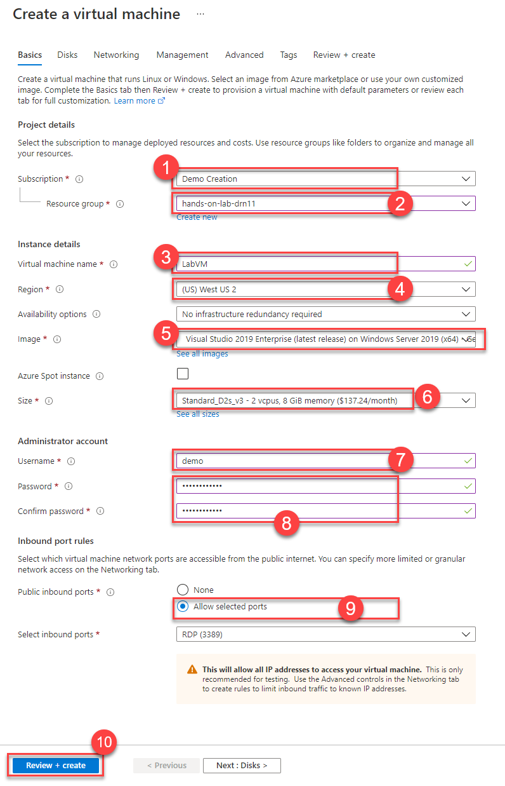

   > **Note**: Default settings are used for the remaining tabs so that they can be skipped.

4. Select **Review + create (10)** to validate the configuration.

5. On the **Review + create** tab, ensure the Validation passed message is displayed, and then select **Create** to provision the virtual machine.

## Task 2: Setting up the Lab VM

1. In the [Azure portal](https://portal.azure.com), navigate to your **LabVM** Virtual Machine by selecting **Resource groups** from Azure services list, selecting the **hands-on-lab-SUFFIX** resource group, and selecting the **LabVM** Virtual Machine from the list of resources.

    

2. On the LabVM Virtual Machine's **Overview** blade, select **Connect (1)** and **RDP (2)** on the top menu.

   

3. Select **Download RDP File** on the next page, and open the downloaded file.

    

4. Select **Connect** on the Remote Desktop Connection dialog.

    

5. Enter the following credentials with your password when prompted, and then select **OK**:

   - **Username**: demo
   - **Password**: Password.1!!

    

6. Select **Yes** to connect if prompted that the remote computer's identity cannot be verified.

    

7. Once logged in, launch the **Server Manager**. This should start automatically, but you can access it via the Start menu if it does not.

8. Select **Local Server (1)**, then select **On (2)** next to **IE Enhanced Security Configuration**. In the Internet Explorer Enhanced Security Configuration dialog, select **Off (3) (4)** under both Administrators and Users, and then select **OK (5)**.

    

9. Close the Server Manager.

10. Right-click the Windows Start Menu and select **Windows PowerShell (Admin)** to start a terminal session.

    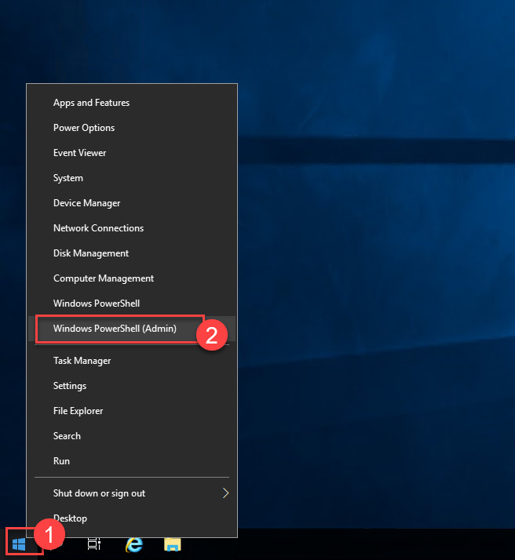

11. Run the code below to download the lab files and extract the content into the `C:\MCW` folder.

    ```PS
    $branchName = "main"
    New-Item -ItemType directory -Path C:\MCW
    while((Get-ChildItem -Directory C:\MCW | Measure-Object).Count -eq 0 )
    {
        (New-Object System.Net.WebClient).DownloadFile("https://github.com/solliancenet/Solliance_AI_Led_business_process_automation/zipball/$branchName", 'C:\MCW.zip')
        Expand-Archive -LiteralPath 'C:\MCW.zip' -DestinationPath 'C:\MCW' -Force
    }
    $item = get-item "c:\mcw\*"
    Rename-Item $item -NewName "MCW-$branchName"
    ```

    > **INFO**: You can copy multiline code from outside the RDP window and paste it into the terminal in the RDP session. In case of difficulty copying the content, go to the RDP terminal and right-click the top left terminal logo **(1)**. This will open a context menu where you can find the Edit > Paste **(3)** command. After you paste the code, hit **Enter** to execute the final line.

    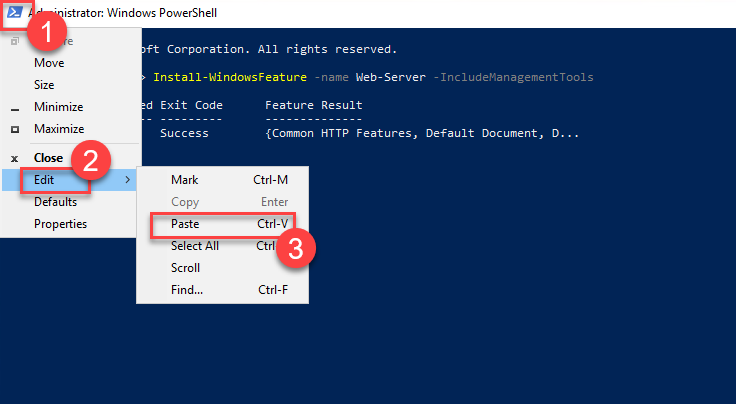

12. Download and install the tools listed below into the LabVM.

    | Name             | Link                                                                                                                                            |
    |------------------|-------------------------------------------------------------------------------------------------------------------------------------------------|
    | Microsoft Edge   | <https://msedge.sf.dl.delivery.mp.microsoft.com/filestreamingservice/files/e2d06b69-9e44-45e1-bdf5-b3b827fe06b2/MicrosoftEdgeEnterpriseX64.msi> |
    | Git              | <https://github.com/git-for-windows/git/releases/download/v2.32.0.windows.1/Git-2.32.0-64-bit.exe>                                              |
    | Power BI Desktop | <https://download.microsoft.com/download/8/8/0/880BCA75-79DD-466A-927D-1ABF1F5454B0/PBIDesktopSetup_x64.exe>                                    |

## Task 3: Create an Azure Storage Account

In this task, you provision an Azure Storage account used to store and serve Claims Forms and Audio recordings. Additionally, the storage account will hold Forms Recognizer training data and serve as a backing Storage Account for Azure Functions.

1. In the [Azure portal](https://portal.azure.com/), go to your hands-on-lab-SUFFIX resource group and select **+Add (1)** from the menu.

   

2. Enter "storage account **(1)**" into the Search the Marketplace box, and select **Storage account** from the results, and then select **Create (2)**.

   

3. On the Create storage account **Basics** tab, enter the following:

   - Project Details:

     - **Subscription (1)**: Select the subscription you are using for this hands-on lab.
     - **Resource Group (2)**: Select the hands-on-lab-SUFFIX resource group from the list of existing resource groups.

   - Instance Details:

     - **Storage account name (3)**: Enter contosoSUFFIX.
     - **Location (4)**: Select the location you are using for resources in this hands-on lab.
     - **Performance (5)**: Choose **Standard**.
     - **Replication (6)**: Select **Locally-redundant storage (LRS)**.

   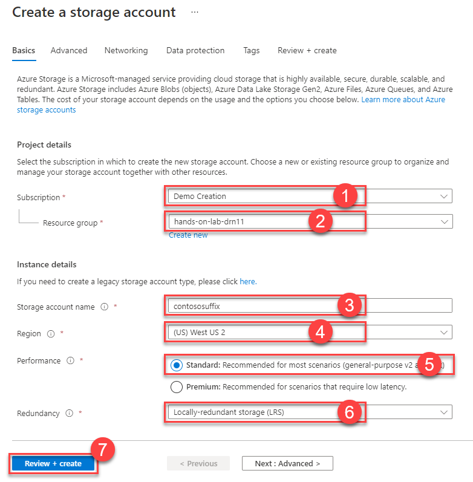

4. Select **Review + create (7)**.

5. On the **Review + create** blade, ensure the Validation passed message is displayed and then select **Create**. Once deployment is complete, select **Go To Resource** to navigate to the Storage Account.

## Task 4: Setting up the Azure Storage Account

1. Switch to the **Resource sharing (CORS) (1)** page and add a new Blob service CORS rule adding the values below. Once you are done, select **Save (5)**.

    | Allowed origins | Allowed methods | Allowed headers |
    |-----------------|-----------------|-----------------|
    | *               | Select All      | *               |

    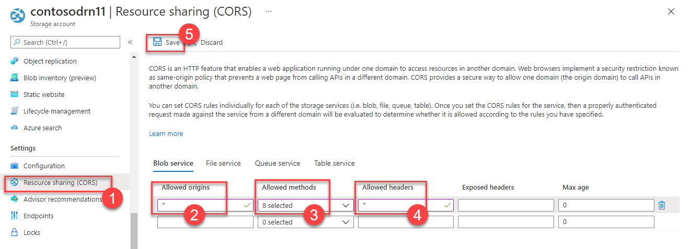

2. Switch to the **Containers (1)** page and select **+Container (2)**. On the **New container** dialog set **Name** to **claims (3)**. Select **Create (4)** to create the new container.

    

3. Repeat the previous container creation steps for containers **claimstraining** and **audiorecordings** containers.

4. In the [Azure portal](https://portal.azure.com), navigate to your **LabVM** Virtual Machine by selecting **Resource groups** from Azure services list, selecting the **hands-on-lab-SUFFIX** resource group, and selecting the **LabVM** Virtual Machine from the list of resources.

    

5. On the LabVM Virtual Machine's **Overview** blade, select **Connect (1)** and **RDP (2)** on the top menu.

    

6. Select **Download RDP File** on the next page, and open the downloaded file.

    

7. Select **Connect** on the Remote Desktop Connection dialog.

    

8. Enter the following credentials with your password when prompted, and then select **OK**:

    - **Username**: demo
    - **Password**: Password.1!!

    

9. Select **Yes** to connect if prompted that the remote computer's identity cannot be verified.

    

10. Once logged in, launch **Edge** and navigate to the [Azure portal](https://portal.azure.com). Enter your credentials to access your subscriptions. Navigate to **contosoSUFFIX** storage account by selecting **Resource groups** from Azure services list, selecting the **hands-on-lab-SUFFIX** resource group, and selecting the **contosoSUFFIX** Storage Account from the list of resources.

    

11. Switch to the **Containers (1)** panel. Select the **claims (2)** container.

    

12. Select **Upload (1)** and **Browse (2)**. Navigate to `C:\MCW\MCW-main\Hands-on lab\lab-files\claims-forms` **(3)**. Pick **20210621-test-form (4)** and select **Open (5)**. This PDF file is brand new in the eyes of our trained model and not used during model training.

    

13. Select **Upload** to start the upload process.

## Task 5: Create a Translator resource

In this task, you provision a Translator resource used to translate transcriptions to English.

1. In the [Azure portal](https://portal.azure.com/), go to your hands-on-lab-SUFFIX resource group and select **+Add (1)** from the menu.

   

2. Enter "Translator **(1)**" into the Search the Marketplace box, and select **Translator** from the results, and then select **Create (2)**.

   

3. On the Create Translator resource **Basics** tab, enter the following:

   - Project Details:

     - **Subscription (1)**: Select the subscription you are using for this hands-on lab.
     - **Resource Group (2)**: Select the hands-on-lab-SUFFIX resource group from the list of existing resource groups.

   - Instance Details:

     - **Region (3)**: Select the location you are using for resources in this hands-on lab.
     - **Name (4)**: Enter contoso-translate-SUFFIX.
     - **Pricing Tier (5)**: Choose **Standard S1**.

   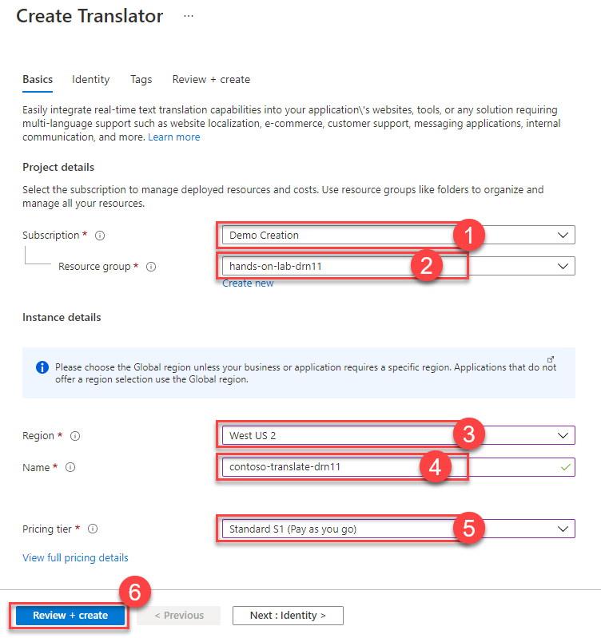

4. Select **Review + create (6)**.

5. On the **Review + create** blade, ensure the Validation passed message is displayed and then select **Create**.

## Task 6: Create a Text Analytics resource

In this task, you provision a Text Analytics resource used to extract medical information from claims documents.

1. In the [Azure portal](https://portal.azure.com/), go to your hands-on-lab-SUFFIX resource group and select **+Add (1)** from the menu.

   

2. Enter "Text Analytics **(1)**" into the Search the Marketplace box, and select **Text Analytics** from the results, and then select **Create (2)**.

   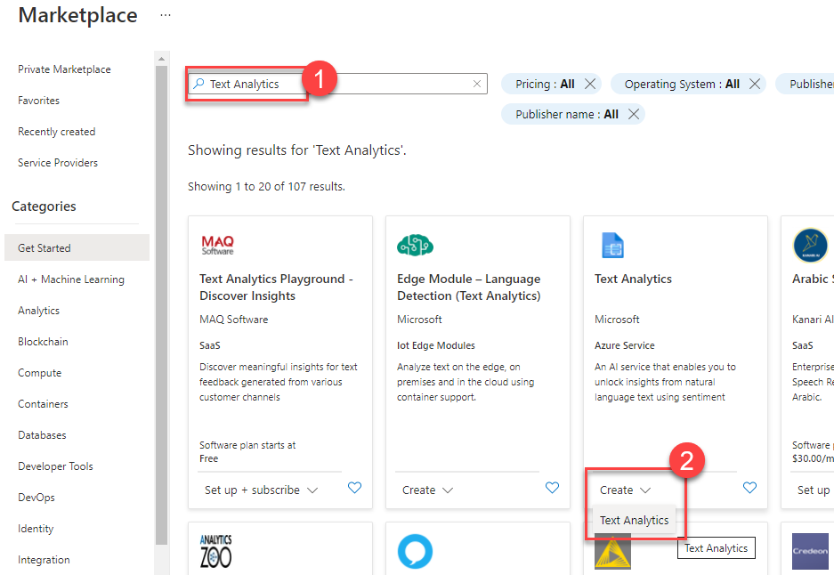

3. Select **Continue to create your resource** when asked for additional features.

4. On the Create Text Analytics resource **Basics** tab, enter the following:

   - Project Details:

     - **Subscription (1)**: Select the subscription you are using for this hands-on lab.
     - **Resource Group (2)**: Select the hands-on-lab-SUFFIX resource group from the list of existing resource groups.

   - Instance Details:

     - **Region (3)**: Select the location you are using for resources in this hands-on lab.
     - **Name (4)**: Enter contoso-textanalytics-SUFFIX.
     - **Pricing Tier (5)**: Choose **Standard S**.
     - Check the Responsible AI Notice **(6)**

   

5. Select **Review + create (7)**.

6. On the **Review + create** blade, ensure the Validation passed message is displayed and then select **Create**.

## Task 6: Create a Speech resource

In this task, you provision a Speech resource used to detect the language of voice recordings and do transcriptions.

1. In the [Azure portal](https://portal.azure.com/), go to your hands-on-lab-SUFFIX resource group and select **+Add (1)** from the menu.

   

2. Enter "Speech **(1)**" into the Search the Marketplace box, and select **Speech** from the results, and then select **Create (2)**.

   

3. On the create Speech resource page, enter the following:

   - **Name (1)**: Enter contoso-speech-SUFFIX.
   - **Subscription (2)**: Select the subscription you are using for this hands-on lab.
   - **Location (3)**: Select the location you use for resources in this hands-on lab.
   - **Pricing Tier (4)**: Choose **Standard S0**.
   - **Resource Group (5)**: Select the hands-on-lab-SUFFIX resource group from the list of existing resource groups.

   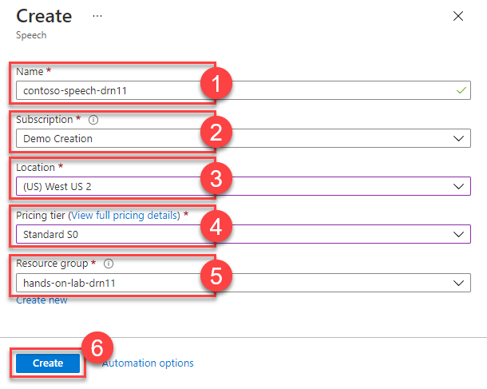

4. Select **Review + create (6)**.

5. On the **Review + create** blade, ensure the Validation passed message is displayed and then select **Create**.

## Task 7: Create a Cognitive Search resource

In this task, you provision a Cognitive Search resource used to search for claims and audio transcriptions data through the hospital portal.

1. In the [Azure portal](https://portal.azure.com/), go to your hands-on-lab-SUFFIX resource group and select **+Add (1)** from the menu.

   

2. Enter "Search **(1)**" into the Search the Marketplace box and select **Azure Cognitive Search** from the results, and then select **Create (2)**.

   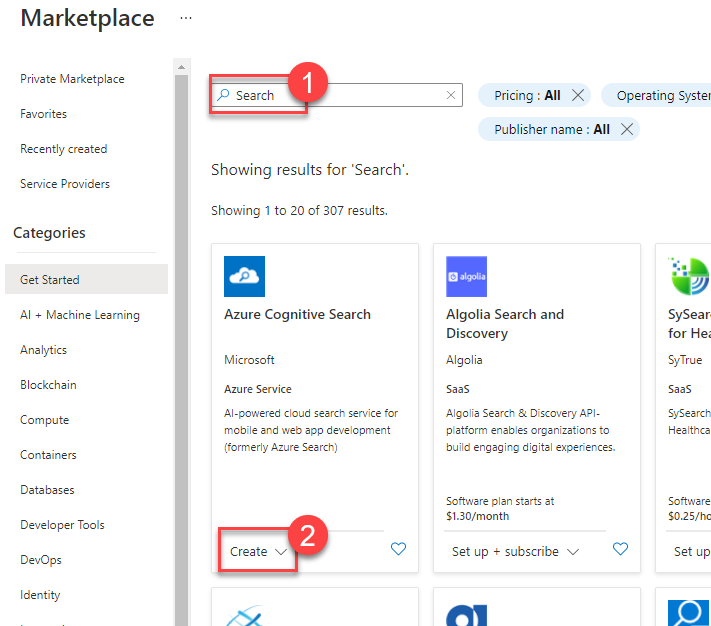

3. On the New Search Service page **Basics** tab, enter the following:

   - Project Details:

     - **Subscription (1)**: Select the subscription you are using for this hands-on lab.
     - **Resource Group (2)**: Select the hands-on-lab-SUFFIX resource group from the list of existing resource groups.

   - Instance Details:

     - **Service Name (3)**: Enter contoso-search-SUFFIX.
     - **Region (4)**: Select the location you are using for resources in this hands-on lab.
     - **Pricing Tier (5)**: Choose **Standard**.

   

4. Select **Review + create (6)**.

5. On the **Review + create** blade, ensure the Validation passed message is displayed and then select **Create**.

## Task 8: Create a Forms Recognizer resource

In this task, you provision a Forms Recognizer resource used to search extract structured information from claims forms.

1. In the [Azure portal](https://portal.azure.com/), go to your hands-on-lab-SUFFIX resource group and select **+Add (1)** from the menu.

   

2. Enter "Forms Recognizer **(1)**" into the Search the Marketplace box, and select **Forms Recognizer** from the results, and then select **Create (2)**.

   

3. On the Create Forms Recognizer page **Basics** tab, enter the following:

   - Project Details:

     - **Subscription (1)**: Select the subscription you are using for this hands-on lab.
     - **Resource Group (2)**: Select the hands-on-lab-SUFFIX resource group from the list of existing resource groups.

   - Instance Details:

     - **Region (3)**: Select the location you are using for resources in this hands-on lab.
     - **Name (4)**: Enter contoso-fr-SUFFIX.
     - **Pricing Tier (5)**: Choose **Standard S0**.

   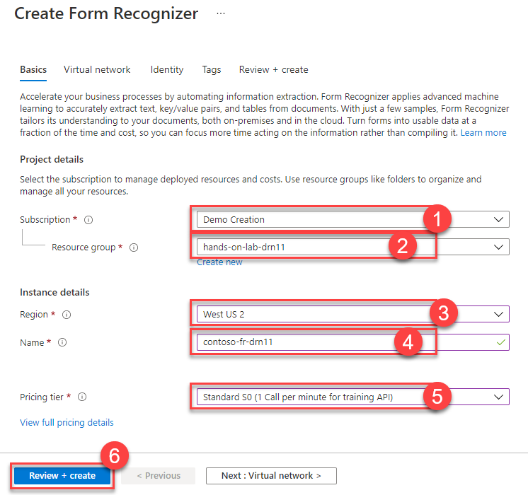

4. Select **Review + create (6)**.

5. On the **Review + create** blade, ensure the Validation passed message is displayed and then select **Create**.

## Task 9: Create a Cosmos DB resource

In this task, you provision a Cosmos DB resource to store claims and audio transcription data sets accessed by custom Power BI reports.

1. In the [Azure portal](https://portal.azure.com/), go to your hands-on-lab-SUFFIX resource group and select **+Add (1)** from the menu.

   

2. Enter "Cosmos DB **(1)**" into the Search the Marketplace box, and select **Azure Cosmos DB** from the results, and then select **Create (2)**.

   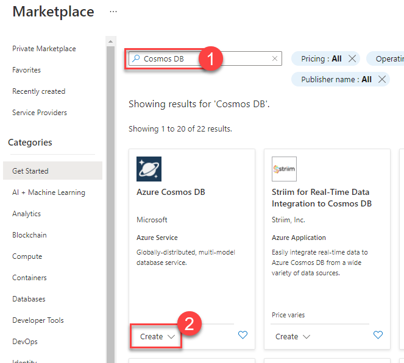

3. On the Select API Option page select **Create** for **Core (SQL) - Recommended** option.

   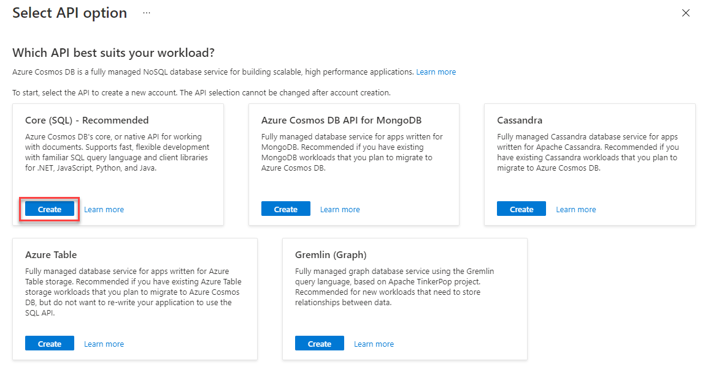

4. On the Create Azure Cosmos DB Account page **Basics** tab, enter the following:

   - Project Details:

     - **Subscription (1)**: Select the subscription you are using for this hands-on lab.
     - **Resource Group (2)**: Select the hands-on-lab-SUFFIX resource group from the list of existing resource groups.

   - Instance Details:

     - **Account Name (3)**: Enter contoso-cdb-SUFFIX.
     - **Location (4)**: Select the location you are using for resources in this hands-on lab.
     - **Capacity Mode (5)**: Choose **Serverless**.

   

5. Select **Review + create (6)**.

6. On the **Review + create** blade, ensure the Validation passed message is displayed and then select **Create**.

## Task 10: Create a Function App

In this task, you provision a Function App service used to host the functions processing claims and audio files using various Cognitive Services.

1. In the [Azure portal](https://portal.azure.com/), go to your hands-on-lab-SUFFIX resource group and select **+Add (1)** from the menu.

   

2. Enter "Function App **(1)**" into the Search the Marketplace box, and select **Function App** from the results, and then select **Create (2)**.

   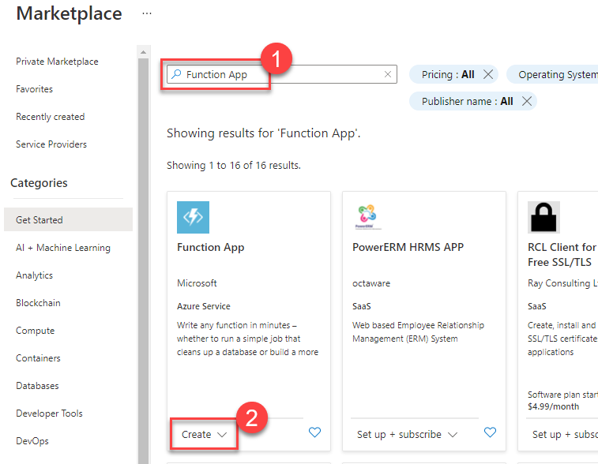

3. On the Create Function App page **Basics** tab, enter the following:

   - Project Details:

     - **Subscription (1)**: Select the subscription you are using for this hands-on lab.
     - **Resource Group (2)**: Select the hands-on-lab-SUFFIX resource group from the list of existing resource groups.

   - Instance Details:

     - **Function App name(3)**: Enter contoso-func-SUFFIX.
     - **Publish (4)**: Select **Code**.
     - **Runtime stack (5)**: Select **.NET**.
     - **Version (6)**: Select **3.1**.
     - **Region (7)**: Select the location you are using for resources in this hands-on lab.

   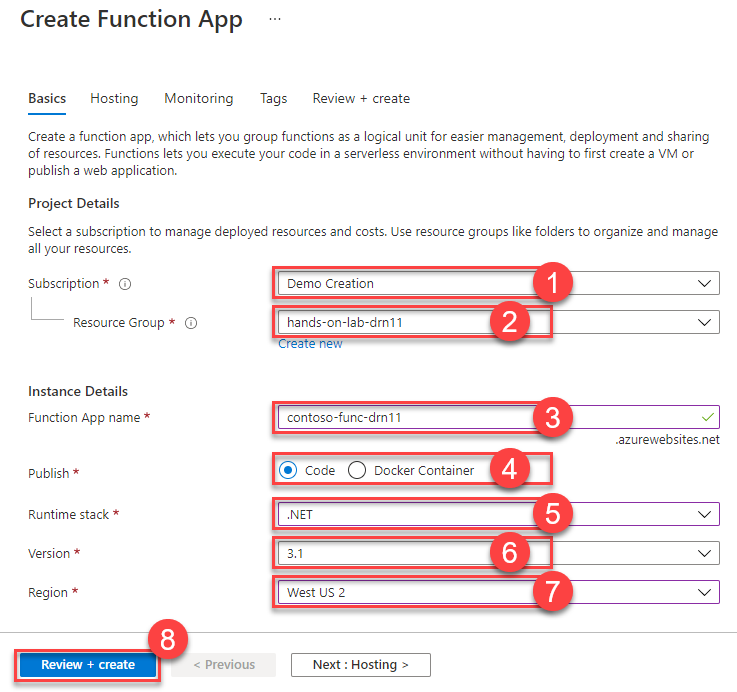

4. Select **Review + create (8)**.

5. On the **Review + create** blade, ensure the Validation passed message is displayed and then select **Create**.

## Task 11: Create a Web App

In this task, you provision a Web App service used to host the hospital portal.

1. In the [Azure portal](https://portal.azure.com/), go to your hands-on-lab-SUFFIX resource group and select **+Add (1)** from the menu.

   

2. Enter "Web App **(1)**" into the Search the Marketplace box, and select **Web App** from the results, and then select **Create (2)**.

   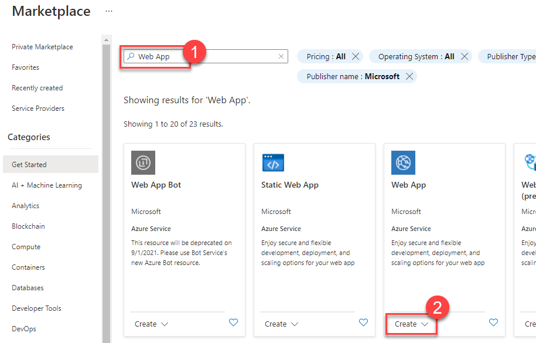

3. On the Create Web App page **Basics** tab, enter the following:

   - Project Details:

     - **Subscription (1)**: Select the subscription you are using for this hands-on lab.
     - **Resource Group (2)**: Select the hands-on-lab-SUFFIX resource group from the list of existing resource groups.

   - Instance Details:

     - **Name (3)**: Enter contoso-portal-SUFFIX.
     - **Publish (4)**: Select **Code**.
     - **Runtime stack (5)**: Select **.NET 5**.
     - **Operating System (6)**: Select **Windows**.
     - **Region (7)**: Select the location you are using for resources in this hands-on lab.

   - App Service Plan:

     - **Sku and size (8)**: Select **Basic B1**.

   

4. Select **Review + create (9)**.

5. On the **Review + create** blade, ensure the Validation passed message is displayed and then select **Create**.

## Task 12: Deploy Web and Functions Apps

In this task, you will deploy the web and functions app into the web app and function app services previously provisioned.

1. In the Azure Portal, open the Azure Cloud Shell by selecting its icon from the right side of the top toolbar. Be sure to select **Powershell** as the shell type.

    

    > **Note**: If you are prompted to create a storage account for the Cloud Shell, agree to have it created.

2. In the Cloud Shell window, enter the following command to download and deploy the function app.

    ```PowerShell
    (New-Object System.Net.WebClient).DownloadFile('https://github.com/solliancenet/Solliance_AI_Led_business_process_automation/raw/main/Hands-on%20lab/lab-files/source-azure-functions/DocumentProcessing.zip', 'Document.Zip')
    az functionapp deployment source config-zip -g "hands-on-lab-SUFFIX" -n "contoso-func-SUFFIX" --src "Document.Zip" --subscription "YOUR-SUBSCRIPTION-ID-COMES-HERE"   
    ```

3. In the Cloud Shell window, enter the following command to download and deploy the web app.

    ```PowerShell
    (New-Object System.Net.WebClient).DownloadFile('https://github.com/solliancenet/Solliance_AI_Led_business_process_automation/raw/main/Hands-on%20lab/lab-files/source-hospital-portal/contoso-web.zip', 'contoso-web.zip')
    az webapp deployment source config-zip -g "hands-on-lab-SUFFIX" -n "contoso-portal-SUFFIX" --src "contoso-web.zip" --subscription "YOUR-SUBSCRIPTION-ID"  
    ```
